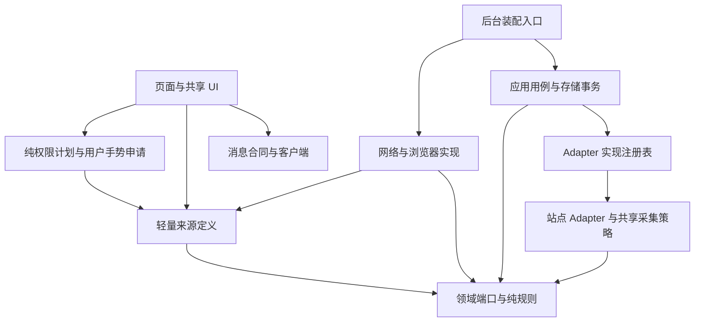

# 复用、可维护性与扩展能力升级计划

> 状态：待实施。制定日期：2026-10-08。本文件是设计与实施计划，不代表相关改造已经完成。
>
> 依据：[项目复用审计](../qa/code-reuse-audit.md)。适用范围：五个 OJ Adapter、领域与应用规则、网络与权限模块、两个页面及测试基础设施。
>
> 本轮目标是减少独立维护的重复规则，让现有行为可验证、模块职责明确、新增来源有固定接入步骤。保留现有技术栈与数据协议，按小批次迁移。

## 1. 升级目标与范围

本轮优先实现以下结果：

| 目标         | 完成后应能观察到的变化                                                       |
| ------------ | ---------------------------------------------------------------------------- |
| 可靠         | 采集完整性、身份变化、取消、限流与 Cookie 收尾有明确合同；每次迁移有回归证据 |
| 可维护       | 名称、固定站点、消息公共字段与公共采集规则各有唯一维护入口                   |
| 可扩展       | 新增 OJ 使用现有端口及小型策略，UI 不需要新增来源分支或导入采集实现          |
| 实际减少重复 | 洛谷/QOJ 复用采集状态与规则，错误样板、测试环境和下拉基础样式不再分别维护    |

不以文件数量、某个文件缩到多少行、删掉多少测试作为成功标准。记录净代码变化与维护点变化，但不预设缩减百分比。

范围约束：

- 不更换 React/WXT/TypeScript，不引入大型 schema、RPC、任务调度或插件框架。
- 不扩大同步范围、分页预算、网络权限或认证能力；不做全历史采集或云端同步。
- 不改变存储与消息 schema 2，不重写账号身份键、提交唯一键、偏好结构或单写入者模型。
- 各站原始 verdict、语言、HTML/JSON 结构、认证回退、下一页依据和游标规则继续留在站点模块。
- 长文件按职责拆分是后续维护手段，不作为本轮主要去重成果。

## 2. 兼容合同：先固定行为，再迁移实现

以实施起点的代码、回归测试和当前 README 为行为基线。审计中的 503 个通过用例是历史快照；开始实施时重新记录基线，不硬编码测试数量。

必须保持：

1. 添加账号只验证身份与保存配置，不自动采集记录。重新授权保留已有 enabled 选择和缓存，递增凭证版本。
2. 采集使用冻结的毫秒闭区间 `[since, until]`，默认最近 7 天，最多最近 35 天。显示筛选范围与采集范围仍是不同用途。
3. 窗口外记录不进入本轮结果、不占记录额度、不请求单条详情；此前已缓存的范围外记录继续按保留策略管理。
4. 首个成功页之前的失败仍是失败；已取得可靠页面后，允许的后续错误可以产生 partial。身份变化与用户取消不能降格为部分成功。
5. complete 必须有尾部、可靠时间边界或所有流完成的证据；额度、重复页、未知分页、无效记录与 deadline 不能伪报完整。
6. 只有完整采集更新 lastSuccessAt；partial 可以合并已验证记录，保留旧成功时间；用户取消丢弃本轮新结果。
7. 账号任务的共享键、凭证版本、代际失效、一个运行任务与一个待执行窗口、15 分钟任务时限保持不变。清空/删除后旧结果不能回填。
8. 每轮同步冻结分页配置；同 origin 共享逻辑页队列与冷却。force 只绕过 freshness，不绕过节流、预算或 429 冷却。
9. Cookie 恢复完成之后才能释放对应锁；Hydro 会话锁、分页锁与 Cookie 锁保留独立实例和既定嵌套顺序。
10. 数据写入仍只经后台 StoragePort；网络请求在事务外；公共响应不能包含凭证或内部活动缓存。
11. Hydro 实例和 domainId 精确隔离；公开数据 origin、导航 origin 与凭证 origin 分别校验。
12. 保留原有记录选择顺序、重复记录取值、诊断语义、错误字段和进度统计方式。抽取代码本身不顺带改变政策。

历史账号/分页计划中仍有“授权后首次采集”的描述，与当前实现及 README 不一致。阶段 S0 将这类条款注明为历史行为或更新到当前合同；本轮不恢复该流程。其他已实施合同继续参考[分页与覆盖计划](./submission-sync-window-and-pagination-throttle.md)和[账号系统 Spec](./account-system-refactor-spec.md)。

发现现有缺陷时，先用针对性用例记录，单独提交修复及行为说明。复用迁移与行为修正分别评审，避免无法判断差异来自哪里。

## 3. 目标模块结构与依赖约束

保持现有分层，补齐轻量来源定义和真正共有的小策略。以下新路径是建议落点；实施时允许合并过小模块，但责任与依赖方向必须保留。

| 模块                         | 责任                                                 | 禁止承担的责任                                           |
| ---------------------------- | ---------------------------------------------------- | -------------------------------------------------------- |
| `src/domain/`                | 端口、数据类型、身份/窗口/覆盖/授权输入等纯规则      | 浏览器 API、站点请求、HTML 解析、来源实现注册            |
| `src/sources/definitions.ts` | 只读来源描述与固定站点事实，依赖领域类型             | 网络、浏览器、Adapter 实现、账号凭证值                   |
| `src/adapters/<source>/`     | 站点身份、请求组织、解析、归一化、分页证据与特殊政策 | 写主存储、自己的冷却队列、UI 状态                        |
| `src/adapters/shared/`       | 已归一化页面状态、采集失败分类、HTML 基础处理        | 根据 SourceId 切换 raw-record 算法、浏览器 API、网络重试 |
| `src/application/`           | 授权/同步用例、生命周期、提交事务、公共 DTO          | 解释 HTML、站点页码或活动内部字段                        |
| `src/platform/`              | HTTP、Cookie、权限、队列和可取消等待                 | 采集覆盖判断、结果合并、页面文案                         |
| `entrypoints/shared/`        | UI 消息客户端、共享组件、展示配置与基础样式          | 导入完整采集注册表、直接写主存储                         |
| `tests/helpers/`             | 内存端口、异步控制、基础响应与合法测试对象           | 使用被测算法生成预期值、替用例隐藏触发顺序               |



箭头表示依赖。应用层继续可以选择 Adapter；页面只读取描述。平台为领域端口提供实现，后台负责组装单例并注入，Adapter 不自行创建另一份 HTTP、分页或冷却实例。

实施后增加一个窄范围的静态依赖检查：禁止 domain/sources 导入 application/adapters/entrypoints 或浏览器 API；禁止页面及其依赖链导入完整 Adapter 注册表。检查应能解析静态 import、re-export 与字面量动态 import，识别路径别名，忽略 type-only 导入；解析失败必须报错，不能静默漏查。只使用已有工具能力，不写泛用架构分析框架。

页面目前使用的 Hydro 地址规范化、语言展示 helper 可以保留为明确的小叶子模块；若其依赖引入站点采集实现，再单独拆到纯模块。依赖限制不等于禁止所有包含 `adapters/` 的路径。

## 4. 关键设计

### 4.1 来源定义与实现注册：R02

保留 `SOURCE_IDS` 作为来源集合和顺序的权威定义。新增 `sourceDefinitions`，以 `satisfies Record<SourceId, SourceDefinition>` 保证穷尽覆盖。定义包含当前 metadata、默认官方首页和固定网站 origin；Hydro 的实际 origin 仍来自账号配置。

约束与迁移方式：

- 先搬迁当前描述，不更改名称、来源排序、availability、授权模式、默认模式、凭证字段、dataOrigins 或字段必填语义。
- 元数据接口逐步改为只读数组与只读字段；定义以不可变值使用，不允许消费者根据某账号改写共享描述。
- Adapter 的 metadata 引用同一份描述，不在站点实现内复制对象；前端、权限模块和网络固定 origin 表改读定义。
- 实现注册表改为穷尽的 `Record<SourceId, OJAdapter>`，保留现有查询接口作为迁移适配；校验 registry key 与 metadata.id 一致。全部消费者迁移后删除临时适配。
- 默认分页政策仍由已有 `domain/pagination-policy.ts` 维护；不另在来源定义重复登记数值。图标路径留在 UI 配置，名称读取来源描述。
- manifest 权限仍显式声明；固定 origin 可复用，是否默认授予/可选申请仍由构建配置决定，并由 manifest 审计验证。不得自动把所有来源或 dataOrigins 改成默认 host_permissions。

权限模块从相同 origin 事实派生 Chrome permission pattern；HTTP 与 Cookie 模块分别执行各自政策。公开数据端点不自动成为导航或 Cookie 目标。Hydro 的官方首页只用于说明，不替代用户选择的实例范围。

完成标准：新增一个 SourceId 后，缺少描述、实现、分页默认值或 UI 图标时应由类型/构建检查暴露；页面不再维护独立的 source 名称与固定首页映射，也不再导入实现注册表。

### 4.2 消息客户端与响应构造：R03

在 `entrypoints/shared/runtime-client.ts` 提供统一发送入口；在现有 application/messaging 层补充 envelope 与响应构造 helper。第一版接受 RuntimeMessage，返回 RuntimeResponse 联合类型，由调用方检查 `ok/type`；不开放让调用者指定任意返回类型的泛型。

具体要求：

- 公共 schema 字段来自 `MESSAGE_SCHEMA_VERSION`；requestId 创建集中，但必须允许显式传入同步运行的 requestId，保留进度通知关联。
- 浏览器返回值先作为 unknown；集中检查版本、requestId、ok、响应分支以及该分支必要载荷结构。复用已有领域谓词，避免一个 `as Extract<...>` 冒充验证。
- 异常响应与传输拒绝有稳定的失败分类，调用方转换为现有页面反馈；未检查响应 type 前不能访问 data/result/account。
- 后台 `STATE/UPDATED/AUTHORIZED/SYNC_RESULT` 构造继续通过 `publicStoredData` 脱敏；共用公共字段，保留不同分支的真实载荷。
- RuntimeMessage 的后台严格校验、sender 检查、同步通知顺序检查继续存在。请求客户端不自动重试授权、删除、清空或其他变更命令。
- 响应 envelope 检查不等于修复损坏缓存；存储对象的完整结构校验属于存储边界。若需要补充领域谓词，在单独模块共享谓词，消息拒绝与存储修复策略分开。

先迁移设置读取与 PaginationSettings，再迁移授权与 Timeline。GET_STATE 的不同响应、错误版本、缺失载荷、requestId 不匹配和传输失败均应变成可见失败，不再依赖泛型断言继续渲染。

### 4.3 错误与授权纯规则：R04、R07

扩展现有 `domain/errors.ts` 的构造能力，优先复用 source/requestId 上下文。kind、stage、messageKey、retryable、userAction 的政策由明确参数或已验证的默认规则决定；保留 `AdapterFailure.fromTransport`，避免重复包装已分类错误。

迁移前为各入口登记现有错误字段。例如 QOJ 对普通 HTTP 400 的 retryable 与洛谷/AtCoder 不同，第一轮必须显式保留这一差异。统一政策若有必要，在后续独立修正中完成。

新增纯授权规则模块 `domain/auth-input.ts`，以 AuthModeDefinition 和原始输入为参数，输出规范化输入或字段级 issue/messageKey。UI 呈现 issue，服务端独立执行相同规则；站点仍确认真实身份。

- identifier、非密码字段按当前规则裁剪；密码原始值与“是否为空白”的判断分开，不能统一 trim 密码。
- 按字段声明处理 required 与未知字段；public-handle/browser-session 不携带保存用凭证；Cookie 解析仍调用既有领域及站点 helper。
- 凭证条目的基础合法性谓词可同时用于消息与存储；消息拒绝整条非法命令，存储逐条修复的行为继续保留。
- 浏览器会话检测与用户手势下权限申请仍留在现有流程中，不进入纯校验模块；后台再次检查权限，校验失败不落库。

前后端现有规范化不完全一致的路径需要登记输入样例。默认保留已有边界语义，不将规则合并的副作用当作兼容迁移。

### 4.4 采集状态与覆盖规则：R01

这是主要业务改造，采用“共享规则、保留站点循环”的第一版设计。先迁移洛谷，再迁移 QOJ，每个来源分别验收。

公共覆盖构造移到 `domain/sync-coverage.ts`，让应用层不再依赖 `adapters/shared/submission-window.ts` 来创建领域结果。保留 finalizeCoverage 的冻结窗口、计数处理、非空 partial reasons 与去重语义；不新增第二份 coverage 实现。

公共采集策略只接收已归一化 Submission 或稳定 ID，不接收站点 raw-record 联合类型。建议拆成下列小单元，不要求使用类：

| 策略           | 输入与职责                                                          | 必须保持的语义                                                                                   |
| -------------- | ------------------------------------------------------------------- | ------------------------------------------------------------------------------------------------ |
| 降序窗口跟踪器 | 完整页面的 submittedAt 序列与已有窗口，验证页内/跨页顺序并观察下界  | 必须有站点降序合同；无效时间或逆序后，本轮不能恢复边界信任；不能通过本地排序证明页序             |
| 窗口记录缓冲区 | 按原顺序加入范围内唯一记录，执行记录额度并报告 overflow             | 窗口外不占额度；用已有 submissionKey；洛谷/QOJ 保留首次入选记录，不顺带改成 merge 或最后一条覆盖 |
| 重复页检测器   | 站点提供的完整稳定 ID 序列形成页签名                                | 相邻少量记录重复不等于整页重复；空页由站点尾部逻辑判断，不能一律判重复                           |
| 页进度状态     | 仅在 PaginationRuntime 真正派发逻辑页回调时递增，读取当前保留记录数 | HTTP 重试、HTML/JSON fallback 和一次认证恢复不额外计页；排队取消不计已派发页                     |
| 失败分类       | signal、已成功页数与结构化错误，输出继续抛出或 partial 原因         | 用户取消、身份错误、未知异常不能吞掉；首个成功页之前仍失败；只让洛谷/QOJ 使用相同失败政策        |

调用顺序保留在站点循环中：在现有位置派发请求、验证响应与身份、完整解析和归一化、观察页签名与时间、收集记录、处理尾部证据/额度/下一页。洛谷与 QOJ 当前检查顺序存在差异，搬迁 helper 时不统一异常优先级。

下一页证据继续独立：洛谷的 count/perPage 与 count-only 路径需要保留不同可信度；QOJ 使用解析后的 hasMore；缺乏证据时记录 unverified-coverage。进度估算不是尾部证明。

完成结果按以下规则汇总：

1. 先处理整页，再决定停止；晚于 until 的定位页应继续，早于 since 的记录仅在边界可信时可终止。
2. 尾部或可靠时间边界允许完成，但当前页已有目标记录被额度丢弃，仍返回 record-limit partial。
3. 达到记录或页预算且无法证明覆盖完整，返回 partial；无效记录等已有原因不能被尾部证据清除。
4. partial 原因与 coverage 用一个累积入口最终构造；diagnostics 保留原有信息，不维护可相互矛盾的 complete/hasMore/stopReason 三份事实。
5. 应用层 guardCollection 与提交事务继续重检身份、范围、去重、凭证版本和代际，不能因 Adapter 已过滤就删除写入前防线。

第一版不合并五个 fetchRecent，也不将 AtCoder/Hydro 迁移到页码循环。AtCoder 的包含式升序游标、同秒停滞与详情补全，Hydro 的 ObjectId 证明、多活动共享预算与 merge 均继续使用现有实现。

只有洛谷/QOJ 迁移后仍存在明显相同的控制流程、且无需加入站点条件分支或大量回调钩子时，才另立决策提取有限页码驱动。没有这个证据，也可认定本轮 R01 已完成；复用规则不要求复用所有循环。

### 4.5 网络目标与异步生命周期：R09、R10

在 `platform/network/request-target.ts` 集中从当前 source/options 创建请求目标政策，供请求前与最终 URL 检查调用。第一版沿用 HttpRequestOptions，不新增一套对外配置 DSL。

- origin、协议、URL 凭证与端点路径按现有允许矩阵搬迁；原始 URL 与 response.url 复用同一端点判断。
- 初始凭证选项的来源一致性检查单独保留，不能被“最终 URL 合法”替代；最终响应校验不能扩大授权范围。
- 把允许和拒绝组合登记为数据驱动用例；迁移若改变任何组合，必须单列行为修正。单纯基于函数名推测更严格的目标规则不可直接落地。
- HTTP 429 仍由传输层在读取正文前登记，有限 GET 重试和响应体大小/取消清理继续由 HTTP 客户端负责。
- Timeline 的链接选择复用一个允许判断，提交/回退链接的选择顺序与原始显示方式保持不变。

队列与等待放入条件实施项：确有维护收益时，将相同的串行算法提取为 `createKeyedSerialQueue`；Cookie 与 Hydro session 各创建独立实例。原有清理必须按当前 tail 判断，前一次失败不能阻塞后续任务。

分页队列仍保留自己的取消、TTL、等待与冷却状态；账号任务队列仍保留版本、代际及共享请求规则。不得将三类队列合并成通用调度器。

可取消等待函数可以共享实现，但先确定可选 signal、signal.reason 的传递与现有调用方适配规则。取消正在执行的网络回调时仍等待真实清理完成，不能用 Promise.race 提前释放锁。

### 4.6 HTML 与共享 UI 样式：R08、R05

HTML 实体解码放到 `adapters/shared/html.ts`。先迁移 QOJ/Hydro 的同语义版本，再迁移 branding 等差异调用；只共享明确相同的步骤。

`&nbsp;` 支持、非法 code point、重复解码顺序可能改变已有输出，应作为单独的边界修正记录。第一轮提取用旧输出做对照；QOJ 的 script/style 清理、Hydro 活动徽章移除和 AtCoder 文本提取仍由站点组合。解码不承担 HTML 消毒或 URL 允许判断。

`AnimatedSelect.css` 随组件导入，统一菜单开闭、隐藏、焦点及交互状态。先提取共同声明，再用明确的 compact/form 变体或有限 CSS 变量保留页面尺寸、动画与外观差异。避免把两套完整样式原样搬进 shared 文件后声称去重。

页面基础 reset/字体/背景与共用容器放入 `shared/styles/base.css`。Timeline 的最小宽度、横向滚动、页面布局继续在自身样式中；共享变量命名避免影响 DateTimeRangePicker、Radix 弹层和其他全局选择器。

不批量替换当前只提供默认 type 的 Button/Input 包装。只有出现共同交互或视觉职责时再扩充这类基础组件。

### 4.7 测试基础设施：R06

在迁移业务之前先建立需要的小 helper，逐个测试文件替换。保留已有 account-fixture，避免另写一套账号合法性构造。

| Helper         | 用途                                                        | 约束                                                                             |
| -------------- | ----------------------------------------------------------- | -------------------------------------------------------------------------------- |
| deferred       | 明确控制异步 resolve/reject                                 | 用完成事件驱动竞态，不用固定毫秒睡眠猜顺序                                       |
| memory-storage | 实现 StorageAreaLike，支持初始快照、读取写入和按需延迟/失败 | 真实边界仍调用 createStoragePort；不能把生产事务算法搬进 mock                    |
| http-response  | 创建文本/JSON HttpResponse                                  | status/url/headers/contentType 可显式覆盖，坏响应用例仍写明异常载荷              |
| fetch-input    | 构造合法基础 FetchInput 和立即执行分页端口                  | 关键窗口、limit、signal、authMode 在用例中明确；节流测试不能默认绕过真实 runtime |
| UI mount       | 创建/销毁 root 与 container，清理浏览器 mock/listener       | 入口自挂载与导入副作用仍显式处理；不增加全局隐式 setupEverything                 |

重复的是测试准备步骤，不等于行为覆盖重复。保留站点 fixture、独立预期值、错误字段、请求轨迹及关键断言；不在同一提交里合并大量用例或降低覆盖要求。

## 5. 分阶段实施与评审单元

每个单元独立完成“迁移、删除旧维护点、验证、记录差异”。不先铺设一套无人使用的公共框架。依赖表示开始实施的前提，不要求不同单元共用一个大提交。

| 阶段/单元 | 内容与对应审计项                                     | 依赖             | 交付与退出标准                                                                         |
| --------- | ---------------------------------------------------- | ---------------- | -------------------------------------------------------------------------------------- |
| S0        | 当前行为、基线和历史文档冲突登记                     | 无               | 测试/类型/构建基线、权限/错误/采集行为清单、实施状态页；区分已有问题与新回归           |
| S1-A      | 最小测试 helpers：R06                                | S0               | 先替换少量 application/Adapter 用例，关键断言不变，清理与竞态测试仍有效                |
| S1-B      | 来源定义与 UI 依赖迁移：R02                          | S0               | 单份描述、穷尽注册、权限语义一致、页面导入图检查；记录构建尺寸变化                     |
| S1-C      | 消息客户端与响应 helper：R03                         | S1-B             | 四处页面发送方式收敛，错误响应有反馈，进度 requestId 不变，响应继续脱敏                |
| S2-A      | 错误构造与授权纯规则：R04/R07                        | S1-A、S1-B、S1-C | 错误字段与授权输入对照通过；前后端共用规则但各自执行边界检查                           |
| S2-B      | HTML helper 与领域覆盖构造：R08/R01 基础             | S1-A             | 解析输出对照通过；所有 finalizeCoverage 消费方迁移，应用不再依赖 Adapter 的构造 helper |
| S3-A      | 洛谷采集状态迁移：R01                                | S2-A、S2-B       | 窗口、重复页、count/perPage、错误与请求轨迹对照通过；原始循环仍易读                    |
| S3-B      | QOJ 采集状态迁移：R01                                | S3-A             | 两个来源共用同一套状态/规则；QOJ 登录态和身份检查继续独立；五来源回归通过              |
| S4        | 请求目标及链接判断：R09                              | S1-B、S2-A、S3-B | 初始/最终 URL 允许矩阵一致，网络与导航负向用例通过，权限未扩大                         |
| S5        | 共享样式及剩余测试准备去重：R05/R06                  | S1-B、S1-C、S3-B | 两页样式由组件拥有，关键浏览器交互验收通过，剩余重复 helper 被替换                     |
| S6 条件项 | 简单队列/等待：R10；滚动时间计算与 Timeline 职责拆分 | S4、S5           | 有真实重复或生命周期维护需求再实施；不改变锁实例、数据 writer 和业务合同               |

S0–S5 是核心交付。S6 未实施时明确标为“待后续”，不能将 R10 写成已完成。滚动窗口 helper 若实施，显示筛选可用的 365/36500 preset 不进入同步允许范围。

S3-A 与 S3-B 分开评审，不同时改 HTTP 客户端、Cookie 恢复与五个 Adapter。每个来源迁移后先确认行为对照，再开始下一个来源。

## 6. 验证矩阵与可靠性门禁

测试以真实的可观察行为为目标，复用纯规则测试不替代通过 Adapter→应用→事务的回归路径。

| 类别          | 必须验证的情形                                                                           | 通过标准                                                        |
| ------------- | ---------------------------------------------------------------------------------------- | --------------------------------------------------------------- |
| 窗口与额度    | 两端等值、越界定位页、跨开始边界、同页重复、满额度且到尾部/边界、目标记录 overflow       | 记录集合与原实现一致；完整性不被额度覆盖；范围外不请求详情      |
| 页序与证据    | 页内乱序、跨页逆序、无效时间、重复整页、部分重叠、空页却仍有后续、count 缺失/count-only  | 未证明时不时间提前停止；partial 原因保留；不新增无界扫描        |
| 失败与取消    | 第一页失败、后续 429/5xx、身份变化、未知异常、排队 deadline、执行中用户取消              | 保留原错误/partial 政策；取消不保存新结果；锁等待实际收尾       |
| 账号与事务    | 相同请求复用、不同窗口排队、重授权、删除、清空、旧授权晚返回、提交前失效                 | 旧版本不能覆盖新版本；失效结果不入库、不误更新成功时间          |
| 网络与权限    | 所有允许端点、错误 source/host/path、最终 URL 越界、第三方公开数据、HTTP Hydro、自定义域 | 请求与响应校验使用同一政策；授权和 Cookie 范围不扩大            |
| Cookie 与队列 | 注入/恢复失败、部分注入、原值恢复、请求失败后续可继续、多账号同 origin                   | 恢复完才解锁；错误优先级不变；无跨账号临时 Cookie 污染          |
| 消息与状态    | 非法命令、错误版本/id/type、缺载荷、传输拒绝、乱序进度、脱敏                             | 类型检查拒绝非法发送；运行时拒绝坏响应；凭证不出现在 DTO 或日志 |
| 授权输入      | 缺字段、未知字段、CR/LF、纯空白、密码前后空格、所有现有认证模式                          | 字段规则在 UI/服务一致使用；保留原输入边界语义                  |
| UI            | 下拉键盘/外部关闭/隐藏焦点、窄屏滚动、弹层层级、页面切换、减少动画                       | Chrome/Edge 当前支持范围内外观与交互无回归                      |
| 扩展接入      | 暂时加入一个测试用来源定义或漏掉现有映射                                                 | 类型/依赖/manifest 检查能发现缺失项；页面无采集实现依赖         |

采集迁移期间，用固定 fixture 记录改造前的输出和请求轨迹，再用同一输入对照新实现。对照应包含记录顺序/字段、coverage、diagnostics、错误字段与逻辑页数量；忽略动态 requestId 等非确定字段。不要在生产中同时跑两套采集，也不长期保留旧实现作为测试 oracle；对照完成后留下独立期望与回归用例。

验证按变更范围执行：

- 每单元：typecheck、lint、相关测试、格式与 diff 检查。
- 改采集/消息/授权/网络：执行完整 `pnpm test`，按需要补 `pnpm test:contract`；没有新失败或后续修改时不重复整轮测试。
- 改来源依赖/权限/构建：执行 build 与 audit:manifest，检查页面静态依赖，并比较相同环境下的产物尺寸；不以源码可达性直接推断 bundle 大小。
- 改共享 CSS：执行受影响 UI 测试及 Chrome/Edge 视觉/交互验收；jsdom 通过不代表视觉完成。
- 最终交付：执行全部现有门禁，另显式检查本计划及相关 Markdown，因为当前 `format:check` 脚本不覆盖 docs。

```bash
pnpm typecheck
pnpm lint
pnpm test
pnpm test:contract
pnpm format:check
pnpm exec prettier --check docs/plan/code-reuse-upgrade-plan.md
pnpm build
pnpm audit:manifest
git diff --check
```

真实站点验收使用人工授权的浏览器会话或既有可选 live 测试；不能把未运行的 live/视觉检查标记为通过。在浏览器矩阵中记录日期、平台、场景与实际结果，按涉及的功能决定完成范围。

## 7. 新增 OJ 的固定接入步骤

完成升级后，新增来源按以下顺序操作：

1. 调研并记录身份入口、认证模式、来源范围、列表分页/排序依据、预算、错误与可选详情。没有排序证据就保守处理覆盖。
2. 更新 SOURCE_IDS，填写 sourceDefinitions、分页默认政策、UI 图标及 manifest 必要的可选权限；穷尽检查发现遗漏。
3. 在独立 Adapter 目录实现 authorize、fetchRecent 和必要的会话/品牌方法，注册到后台实现表。只使用注入的 HttpClient、PaginationRuntime 和共享领域规则。
4. 按来源能力选择既有小策略。无法匹配的游标或活动模型保留站点实现，不能为了接入而给公共策略堆 source 分支或空回调。
5. 编写站点解析/身份 fixture 与 Adapter→应用的覆盖用例；补权限允许/拒绝矩阵和浏览器验收。初始未知来源行为应明确报告 partial 或 unsupported。
6. 更新支持来源、隐私/权限说明、研究证据与验收记录。来源出现相同需求后，再判断是否值得提取新的公共能力。

通用 UI 不新增来源 switch；站点确有特殊用户输入或展示需要时，用明确的元数据或小组件扩展，不把网络诊断内部细节直接堆入产品流程。

本计划不新增一套无人消费的 capabilities 布尔矩阵。使用已有 OJAdapter 端口和可选方法；只有真实用例需要新能力时，才演进相应合同。

## 8. 回退方式、状态记录与完成标准

每个评审单元保留独立提交。核心路径保持单实现，临时 re-export/旧查询入口限定到当前迁移阶段，全部调用迁移后移除。回退只撤销对应单元及其依赖提交，不需要迁移或清空用户存储。

如果某个单元必须改变持久化结构、消息 schema、权限集合或业务合同，应停止将它视为本计划内的等价迁移，单独设计兼容、数据升级与回退方案。本计划本身不授权用清空缓存解决迁移问题。

每阶段记录：基线版本、修改入口、已删除的旧维护点、行为差异、相关测试与浏览器结果、依赖图/构建尺寸变化，以及尚未完成的条目。使用已有 QA/发布检查文档，避免新增另一套彼此矛盾的完成状态。

核心交付验收清单：

- [ ] R02：来源名称、首页与固定 origin 有权威定义，UI/权限不依赖完整采集注册表。
- [ ] R03：页面统一消息客户端，后台公共响应封装统一；无调用者指定任意响应类型的断言封装。
- [ ] R04/R07：公共错误字段与授权输入规则被实际复用，站点政策、密码语义和边界验证保留。
- [ ] R01：洛谷/QOJ 共用采集状态与规则，coverage 构造归领域，站点证据与应用写入防线保留。
- [ ] R08/R09：共有 HTML 解码和请求/最终 URL 规则各有单一实现，差异及行为修正有明确记录。
- [ ] R05/R06：共享下拉基础样式由组件拥有，测试准备逻辑已复用，关键断言与浏览器交互未削弱。
- [ ] 兼容合同和验证矩阵通过；新增来源步骤可执行，穷尽与静态依赖检查有效。
- [ ] 临时适配清理，构建/权限/文档状态一致；R10 与其他条件项分别标明已实施或待后续。

预计收益以完成后的事实报告：同一规则的实现份数、需要同步修改的模块数、净代码变化、前端运行时依赖以及回归结果。共享模块若没有实际消费者，或只有换文件而没有减少独立维护点，应在交付前删掉或重新划定边界。
